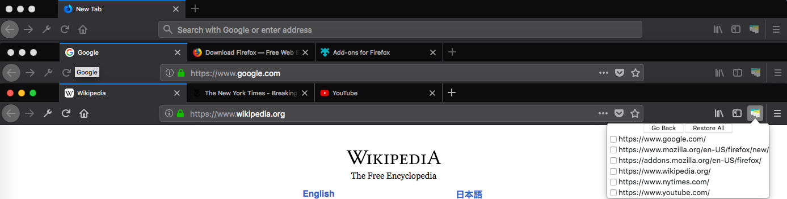

# Tab Save & Restore

[Firefox extension](https://addons.mozilla.org/en-US/firefox/addon/tab-save-restore/) that allows you to save the open tabs from your window and then restore them at a later time. You can restore them individually or all at once.

The motivation behind this extension is to allow for easy tab management without the hassle of being signed in to your browser. Oftentimes, I've wanted to save my open tabs before shutting down my computer, but I prefer not to attach an account to my browser. Before, I would waste time copying and pasting each tab's url to a text file so I could remember what I was doing. Now, by using this extension, it is simply a matter of clicking a few buttons to re-open all of your tabs.

## Usage

Clicking the extension results in two options ```Save``` and ```Restore```.


```Save``` will save the urls of open tabs from every window.

```Restore``` will show a list of the saved urls.


- Clicking an individual link will open that link in a new tab of your active window


- Clicking ```Restore All``` will open every link



  - These links will open in **new** window(s) respective on where they were when saved.
    - e.g. If a user has 2 windows open such that Window 1 contains Tab A, Tab B, & Tab C and Window 2 contains Tab D, Tab E

    Clicking ```Save``` will result in a list containing all of the tabs.

    After closing the browser and then reopening, the user will have one active window. Clicking ```Restore All`` will result in 3 windows such that Window 1 contains the tabs the user already had opened, Window 2 contains Tab A, Tab B, & Tab C, and Window 3 contains Tab D and Tab E

## Changelog

Changes from [sealj553](https://github.com/avbhatt/tabs/pull/1)
- Allows for multi-window saving and restoration

