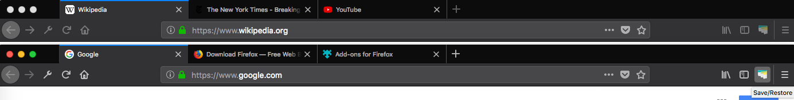
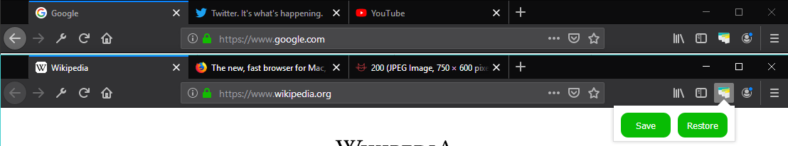
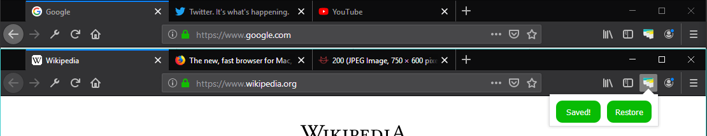
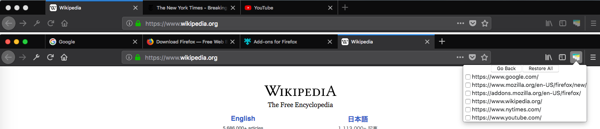
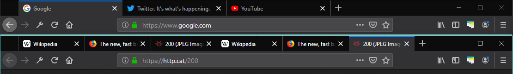
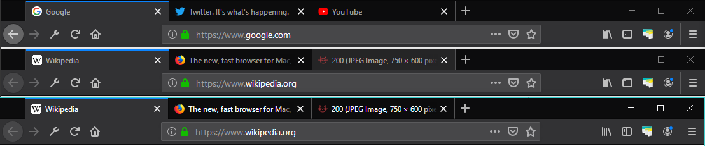
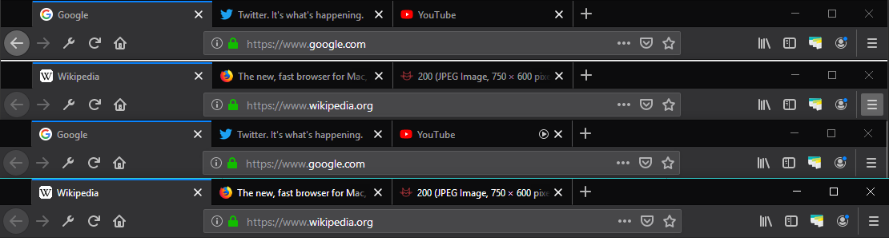

# Tab Save & Restore

[Firefox extension](https://addons.mozilla.org/en-US/firefox/addon/tab-save-restore/) that allows you to save the open tabs from your window and then restore them at a later time. You can restore them individually or all at once.

The motivation behind this extension is to allow for easy tab management without the hassle of being signed in to your browser. Oftentimes, I've wanted to save my open tabs before shutting down my computer, but I prefer not to attach an account to my browser. Before, I would waste time copying and pasting each tab's url to a text file so I could remember what I was doing. Now, by using this extension, it is simply a matter of clicking a few buttons to re-open all of your tabs.

## Usage

Clicking the extension results in two options `Save` and `Restore`.

- `Save` will save the urls of open tabs from every window (replacing any previously saved tabs)

- `Restore` will show a list of the saved urls, organized by window

- Clicking an individual link will open that link in a new tab of the active window

- Clicking `Restore To` provides two options to restore the entire window

- `Current Window` will restore the tabs to the active window

- `New Window` will restore the tabs to a new window

- Clicking `Restore All` will restore every group of tabs into a new window

- Note that clicking `Save` will **overwrite** the currently saved tabs

## Changelog

Window management

- Allow window-by-window restoration

CSS Enhancements from [shikev](https://github.com/avbhatt/tabs/pull/5)

- Improve look and feel of extension

Changes from [sealj553](https://github.com/avbhatt/tabs/pull/1)

- Allows for multi-window saving and restoration
